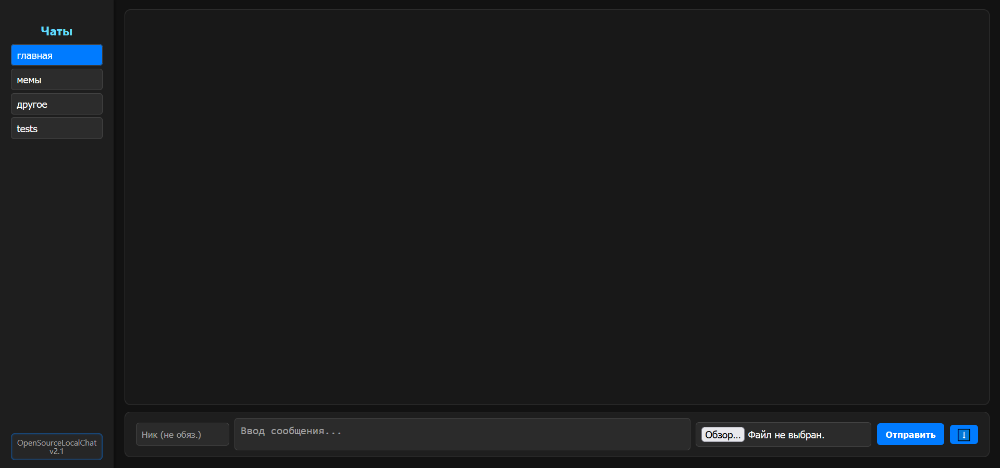
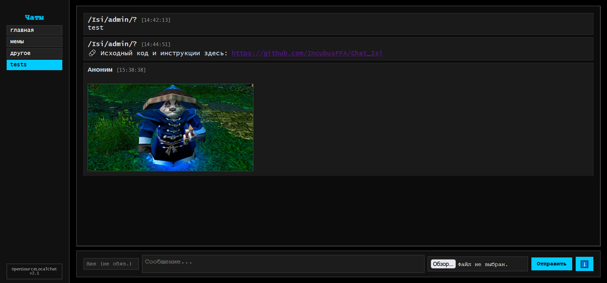

# 🧩 CSS Стили для Анонимного Чата

Здесь представлены различные варианты CSS-оформления интерфейса чата. Каждый стиль можно подключить вручную, заменив `style.css` в корневой директории или подгрузив его отдельно через HTML.

---

## 1. style.css (По умолчанию)

## 2. 2000x.css

### Подключение:
Переименуй нужный файл .css в style.css и перемести его в директорию /static
