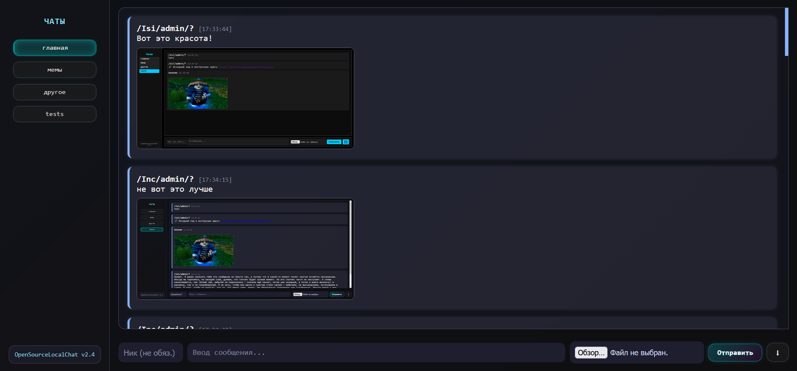

# Chat_Isi

> **Chat_Isi** — это простой и удобный локальный чат для обмена сообщениями в пределах одной сети или на одном компьютере.  
> Идеальное решение для обучения, тестирования и локального общения без интернета.

---

## ✨ Основные возможности

- **Обмен сообщениями в реальном времени**  
  Мгновенная отправка и получение сообщений без задержек.

- **Работа в локальной сети**  
  Не требует подключения к интернету — общение происходит внутри локальной сети или на локальном сервере.

- **Поддержка нескольких пользователей**  
  Несколько человек могут общаться одновременно.

- **Простой и минималистичный интерфейс**  
  Всё, что нужно — чтобы начать писать и получать сообщения.

- **История сообщений в сессии**  
  Сохраняются и отображаются сообщения текущего сеанса.

- **Отображение времени сообщений**  
  Для удобного отслеживания последовательности диалога.

- **Быстрая установка и запуск**  
  Минимум настроек, готово к работе сразу после запуска.

---

## 🚀 Установка и запуск

### Запуск на Arch Linux

sudo pacman -Sy  # обновить базы пакетов (аналог apt update)
sudo pacman -S python python-virtualenv python-pip  # установить Python и необходимые пакеты

cd ~/anon_chat
python -m venv venv           # создаём виртуальное окружение (если создано — пропускаем)
source venv/bin/activate      # активируем виртуальное окружение
pip install flask             # устанавливаем Flask внутри окружения (если не установлен)
python app.py                 # запускаем сервер

###Запуск на Ubuntu

sudo apt update
sudo apt install python3 python3-venv python3-pip  # устанавливаем зависимости, если нужно

cd ~/anon_chat
python3 -m venv venv           # создаём виртуальное окружение (если создано — пропускаем)
source venv/bin/activate       # активируем виртуальное окружение
pip install flask              # устанавливаем Flask внутри окружения (если не установлен)
python3 app.py                 # запускаем сервер

###Запуск на Windows (через cmd или PowerShell)

cd C:\Users\ваше_имя\anon_chat
python -m venv venv               # создаём виртуальное окружение
venv\Scripts\activate             # активируем виртуальное окружение
pip install flask                 # устанавливаем Flask
python app.py                    # запускаем сервер
